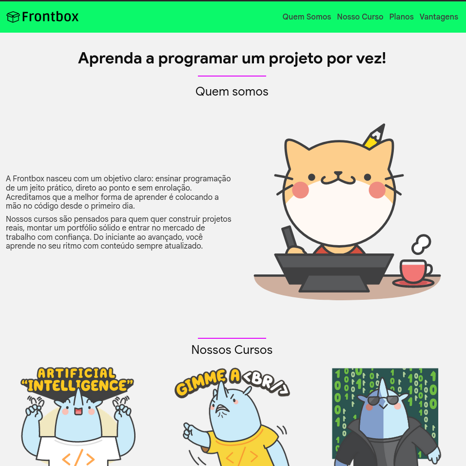

  
     
  Frontbox
   
  <a href="https://www.linkedin.com/in/paulopbi/" target="_blank">Linkedin</a> • 
  <a href="https://github.com/paulopbi/" target="_blank">Github</a> •  
  <a href="https://github.com/paulopbi/frontbox" target="_blank">Repositório</a> •  
  <a href="https://paulopbi.github.io/frontbox/" target="_blank">Demonstração</a>

 

_Frontbox_ é uma landing page para venda de cursos como **inteligência artificial**, **frontend** e **segurança da informação**.

A mesma possui cores vibrantes, um layout moderno O design é focado em destacar os cursos oferecidos, com seções claras e chamativas para incentivar a conversão.

## Demonstração 

  

 

> Imagem de demonstração

## Funcionalidades

- **BEM**: Metodologia de nomenclatura para CSS, que ajuda a manter o código organizado e escalável.
- **Javascript Modules**: Utilizado para organizar o código em módulos reutilizáveis, melhorando a manutenção e a estrutura do projeto.
- **Menu Hambúrguer**: Implementado para melhorar a navegação em dispositivos móveis.
- **Pseudo-elementos**: Utilizados para adicionar elementos visuais ao documento sem modificar o HTML como `::before` e `::after`.
- **Pseudo-classes**: Utilizadas para estilizar elementos com base em seu estado, como `:hover` e `:focus`.
- **Grid**: Utilizado para criar layouts complexos e responsivos, permitindo a organização eficiente dos elementos na página.
- **Flexbox**: Utilizado para criar layouts flexíveis e responsivos, facilitando o alinhamento e a distribuição de elementos na página.
- **Box Sizing**: Utilizado para controlar o dimensionamento dos elementos, incluindo padding e border.
- **Variáveis CSS**: Permite definir valores reutilizáveis em todo o projeto, facilitando a manutenção e a atualização.
- **Media Queries**: Utilizadas para aplicar estilos diferentes com base nas características do dispositivo, como largura da tela.
- **HSL**: Utilizado para definir cores de forma mais intuitiva, baseada em matiz, saturação e luminosidade.

## Tecnologias

- **HTML**: Utilizado para estruturar o conteúdo da página, definindo elementos como cabeçalhos, parágrafos, imagens e links.
- **CSS**: Responsável pela estilização da página, incluindo layout, cores, fontes e responsividade.
- **JavaScript**: Implementa interatividade, como a funcionalidade de navegação suave e a manipulação de elementos DOM para melhorar a experiência do usuário.

## Licença

Este projeto está licenciado sob a [MIT License](./LICENSE).